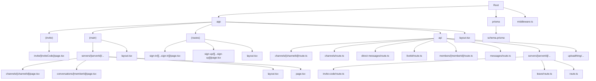

# SyncSphere

SyncSphere is a modern communication and collaboration platform built with Next.js and Clerk. This README provides a comprehensive overview of the project structure, API routes, and architecture.

## Table of Contents

- [Project Overview](#project-overview)
- [Project Structure](#project-structure)
- [API Routes](#api-routes)
- [Database Schema](#database-schema)
- [Authentication](#authentication)
- [Key Features](#key-features)
- [Setup Instructions](#setup-instructions)

## Project Overview

SyncSphere is a real-time communication platform inspired by Discord, allowing users to:
- Create and join servers
- Create channels within servers (text, audio, video)
- Send direct messages to other users
- Share files and media
- Participate in video/audio calls

The application is built with Next.js, Clerk for authentication, Prisma ORM, and integrates real-time features with socket connections.

## Project Structure



## API Routes

The application includes several API endpoints to handle various functionalities:

### Server Management

| Endpoint | Method | Description |
|----------|--------|-------------|
| `/api/servers` | POST | Create a new server with name, image, and automatically create a general channel |
| `/api/servers/[serverId]` | PATCH | Update server details (name, image) |
| `/api/servers/[serverId]` | DELETE | Delete a server (admin only) |
| `/api/servers/[serverId]/invite-code` | PATCH | Generate a new invite code for a server |
| `/api/servers/[serverId]/leave` | PATCH | Leave a server (non-owner only) |

### Channel Management

| Endpoint | Method | Description |
|----------|--------|-------------|
| `/api/channels` | POST | Create a new channel in a server (admin/moderator only) |
| `/api/channels/[channelId]` | PATCH | Update channel details (name, type) |
| `/api/channels/[channelId]` | DELETE | Delete a channel (cannot delete general channel) |

### Member Management

| Endpoint | Method | Description |
|----------|--------|-------------|
| `/api/members/[memberId]` | PATCH | Update a member's role (admin only) |
| `/api/members/[memberId]` | DELETE | Remove a member from a server (admin only) |

### Messaging

| Endpoint | Method | Description |
|----------|--------|-------------|
| `/api/messages` | GET | Get messages for a channel with pagination |
| `/api/direct-messages` | GET | Get direct messages between two users with pagination |

### File Upload

| Endpoint | Method | Description |
|----------|--------|-------------|
| `/api/uploadthing` | POST | Upload files (images, PDFs) for messages |

### LiveKit Integration

| Endpoint | Method | Description |
|----------|--------|-------------|
| `/api/livekit` | GET | Generate token for audio/video chat integration |

## Database Schema

The database is structured around the following main entities:

- **Profile**: User profile information linked to Clerk authentication
- **Server**: Communication servers that contain channels and members
- **Channel**: Different communication channels within a server (text, audio, video)
- **Member**: Users who belong to servers with specific roles (admin, moderator, guest)
- **Message**: Messages sent in channels
- **Conversation**: Direct message conversations between two members
- **DirectMessage**: Messages sent in direct conversations

Key relationships:
- A Profile can own multiple Servers and be a Member of multiple Servers
- A Server has multiple Channels and Members
- A Channel contains multiple Messages
- A Conversation contains multiple DirectMessages between two Members

## Authentication

Authentication is handled by Clerk, which provides:
- User sign-up and sign-in
- Session management
- Protected routes via middleware
- User profile information

## Key Features

1. **Real-time Communication**:
   - Text messaging in channels and direct messages
   - Audio and video calls in designated channels

2. **Server Management**:
   - Create, edit, and delete servers
   - Invite system with unique invite codes
   - Member role management

3. **Channel Organization**:
   - Text channels for text-based communication
   - Audio channels for voice chat
   - Video channels for video conferencing

4. **Direct Messaging**:
   - Private conversations between server members
   - File sharing in direct messages

5. **File Sharing**:
   - Upload and share images and PDFs in messages
   - Server image customization

## Setup Instructions

### Prerequisites
- Node.js and npm/yarn
- MySQL database
- Clerk account
- LiveKit account (for audio/video)
- UploadThing account (for file uploads)

### Environment Variables
```
# Database
DATABASE_URL=

# Clerk Auth
NEXT_PUBLIC_CLERK_PUBLISHABLE_KEY=
CLERK_SECRET_KEY=

# UploadThing
UPLOADTHING_SECRET=
UPLOADTHING_APP_ID=

# LiveKit
LIVEKIT_API_KEY=
LIVEKIT_API_SECRET=
NEXT_PUBLIC_LIVEKIT_URL=
```

### Installation Steps
1. Clone the repository
2. Install dependencies: `npm install`
3. Set up environment variables
4. Run database migrations: `npx prisma migrate dev`
5. Start development server: `npm run dev`